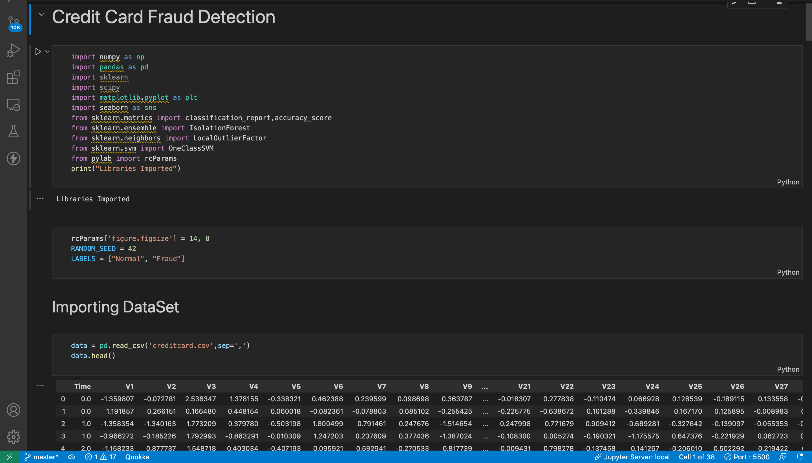
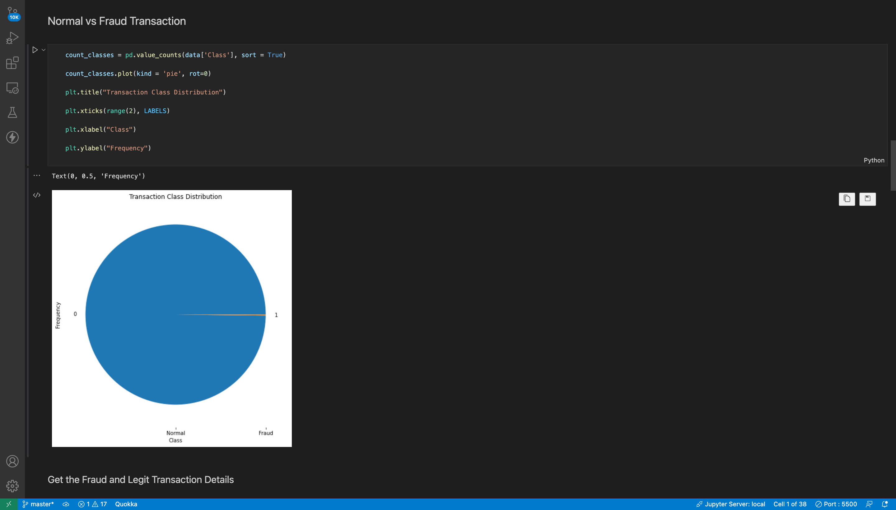
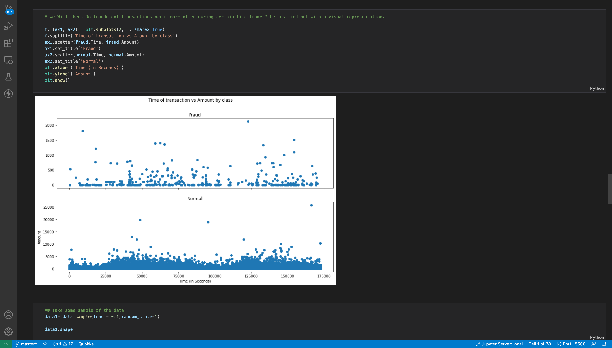
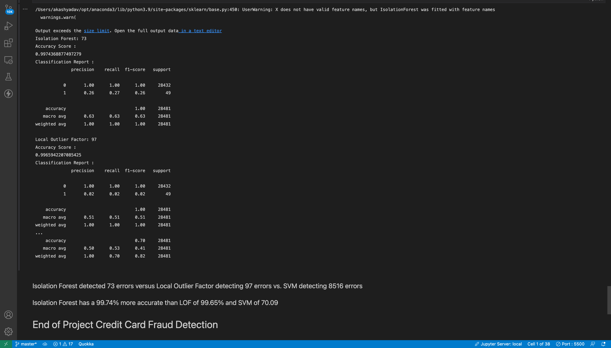

# CreditCardFraudDetection
The objective of credit card fraud detection is to prevent fraudulent transactions by identifying and preventing unauthorized use of credit cards. The goal is to minimize financial losses for both credit card issuers and cardholders by detecting and preventing fraudulent transactions before they occur.

# Description
Credit card fraud is a serious problem that affects millions of people and businesses worldwide. It involves the unauthorized use of credit card information to make purchases or withdrawals without the cardholder's knowledge or consent. Fraudulent transactions can result in significant financial losses for both credit card issuers and cardholders.

Credit card fraud detection involves using advanced algorithms and machine learning techniques to analyze transaction data and identify patterns of fraudulent activity. This can include analyzing transaction amounts, locations, and time of day, as well as the type of merchandise or services being purchased.   

The process of credit card fraud detection typically involves three steps:

1.Data Collection: Collecting and analyzing transaction data from various sources, including point-of-sale systems, online payment gateways, and customer service logs.

2.Data Analysis: Using advanced algorithms and machine learning models to identify patterns of fraudulent activity. This can involve building predictive models that can detect anomalies in transaction data, flagging suspicious transactions for further investigation, and automatically declining transactions that are deemed high risk.

3.Fraud Management: Managing and mitigating the risks associated with credit card fraud. This can involve implementing fraud prevention policies and procedures, training staff on fraud detection techniques, and working with law enforcement agencies to investigate and prosecute fraudulent activity.

Overall, credit card fraud detection is a critical component of the payment processing ecosystem, helping to protect both card issuers and cardholders from financial losses. By using advanced data analytics and machine learning techniques, businesses can identify and prevent fraudulent transactions before they occur, helping to minimize the impact of credit card fraud on their bottom line.

# EDA (Exploratory Data Analysis) 
Credit Card Fraud Detection.  
.  

.  

.  

# Results
.  

# Algorithms Used
Credit card fraud detection algorithms are used by financial institutions to identify and prevent fraudulent transactions on credit cards. Some commonly used algorithms for credit card fraud detection include:

Rule-Based Systems: This approach uses a set of rules to flag transactions that are outside the normal behavior of the cardholder. For example, if a card is used in a foreign country or for an unusually large purchase amount, the transaction may be flagged for review.

Neural Networks: Neural networks are a type of machine learning algorithm that can be used to identify patterns in large datasets. These networks can be trained to recognize patterns that are associated with fraudulent transactions.

Decision Trees: Decision trees are another machine learning algorithm that can be used for fraud detection. These trees can be used to create a set of rules that can be used to identify fraudulent transactions based on certain criteria.

Logistic Regression: Logistic regression is a statistical technique that is used to predict the likelihood of an event occurring. This algorithm can be used to predict the likelihood of a transaction being fraudulent based on certain variables, such as the amount of the transaction or the location of the transaction.

Random Forests: Random forests are an ensemble learning algorithm that combines multiple decision trees to improve the accuracy of the predictions. This algorithm can be used to identify fraudulent transactions by examining multiple variables simultaneously.

Overall, a combination of these algorithms can be used to create a robust fraud detection system that is able to accurately identify and prevent fraudulent transactions on credit cards.

# Source 
Youtube : https://www.youtube.com/  
Python documentation : https://docs.python.org/3/  
Kaggle : https://www.kaggle.com/ 

